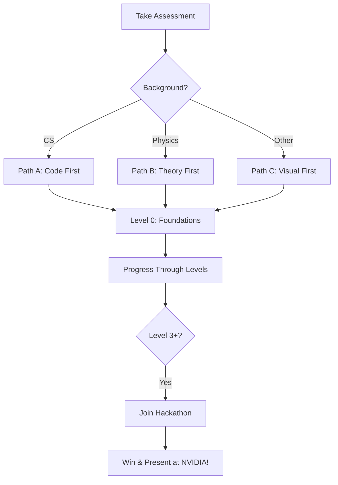

# CUDA-Q Quantum Quest 🚀

## Start Your Quantum Journey → Win a Trip to NVIDIA

### 🎯 The Quest
Complete levels, earn badges, qualify for the hackathon, and potentially present at NVIDIA GTC!

### 🗺️ Your Personalized Path


### 🏁 Quick Start
```bash
# 1. Take the assessment
jupyter notebook onboarding/assessment_quiz.ipynb

# 2. Complete your prerequisites
# (Automatically assigned based on assessment)

# 3. Start Level 0
cd quest_levels/level_0_foundations
```

### 📊 Live Leaderboard
[Link to real-time leaderboard]

### 🏆 Current Champions
- Fastest to Level 5: @quantum_speedrunner (3 days!)
- Most Helpful: @quantum_mentor (helped 47 students)
- Creative Badge: @quantum_artist (beautiful visualizations)